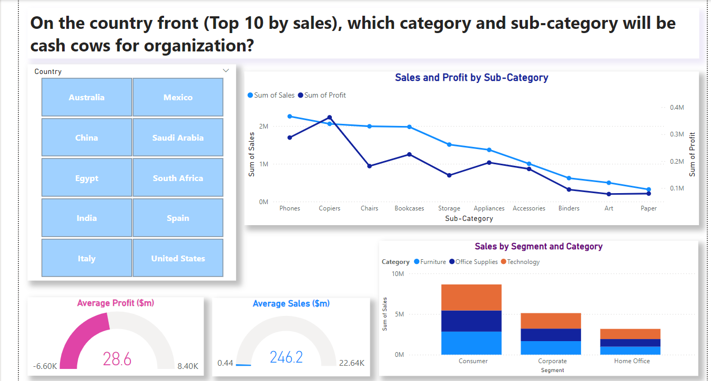

# Global Superstore Analysis Project

**Author**: Sangram Singh  
**Objective**: To provide comprehensive business intelligence for Global Superstore, leveraging data analytics to drive strategic decision-making and ensure consistent growth and profitability at a global level.

---

## Table of Contents
1. [Project Overview](#project-overview)
2. [Mission Statement](#mission-statement)
3. [Data Sources](#data-sources)
4. [Project Scope](#project-scope)
5. [Tools and Technologies Used](#tools-and-technologies-used)
6. [Key Insights](#key-insights)
7. [Deliverables](#deliverables)
8. [Stakeholder Analysis](#stakeholder-analysis)
9. [Business Questions Addressed](#business-questions-addressed)
10. [Risk and Reward Analysis](#risk-and-reward-analysis)

---

## Project Overview

This project was undertaken by **GTN Analytics**, a Canada-based data analytics organization. The goal is to enable strategic decision-making for **Global Superstore** through actionable data-driven insights. The analysis focuses on:
- Evaluating sales performance
- Identifying improvement areas
- Proposing strategies to strengthen market competitiveness

---

## Mission Statement

*"We, GTN Analytics, have been hired by Global Superstore to provide comprehensive business intelligence, playing an enablement role for informed decision-making and strategic actions for consistent growth and profitability at the global level."*

---

## Data Sources

The dataset includes:
- **Sales Transactions**: Time-stamped details
- **Customer Profiles**: Demographic and segmentation data
- **Product and Regional Information**: Sub-product level sales, pricing, discounts, and performance by market

The dataset is well-maintained and consists of:
- **Facts**: Sales, Discounts, Profits, and Quantities
- **Dimensions**: Markets, Regions, Categories, and Customers

---

## Project Scope

### **In-Scope Aspects**
- Comprehensive Sales Trend Analysis
- Detailed Profitability Analysis by product and region
- Impact Analysis of Discounts on Sales
- Regional Sales Performance Evaluation
- Advanced Customer Segmentation

### **Out-of-Scope Aspects**
- Individual-level customer data analysis (due to privacy concerns)
- External economic factors (focus is on internal data)

### **Goals**
1. Deliver actionable insights for better strategic planning
2. Enhance operational and marketing efficiencies
3. Enable data-driven decision-making

---

## Tools and Technologies Used

- **Data Cleaning and Transformation**: SQL, Excel, SSIS
- **Data Visualization**: Power BI, Tableau
- **Statistical Analysis**: Python/R
- **ETL**: SSIS (Extract, Transform, Load)

---

## Key Insights

1. **Sales Performance**:
   - Segmentation of sales data across regions, categories, and time periods.
2. **Profitability Analysis**:
   - Identification of high-margin products and underperforming regions.
3. **Discount Impact**:
   - Effectiveness of discounts in driving sales volumes while maintaining profitability.
4. **Market Insights**:
   - Trends in emerging markets and opportunities for growth.
5. **Customer Behavior**:
   - Repeat purchase patterns indicating customer loyalty.

---

## Deliverables

1. **Cleaned Dataset**:
   - Processed and refined for analysis.
2. **Interactive Dashboards**:
   - Power BI/Tableau dashboards showcasing key findings.
3. **Final Report**:
   - Detailed documentation and recommendations for Global Superstore.

---

## Stakeholder Analysis

- **Executive Leadership**: High-level strategic recommendations.
- **Data Analytics Team**: Guidance for data-driven business strategies.
- **Sales and Marketing**: Insights into product performance and customer segmentation.
- **Operations Managers**: Recommendations for cost and process optimizations.
- **Finance Team**: Financial insights to improve profitability.
- **Customers**: Enhanced experience through targeted strategies.

---

## Business Questions Addressed

1. **Profitability Analysis**:
   - "Does the top-performing country by sales also excel in profitability margins?"
2. **Salesperson Performance**:
   - "Who is the top-performing salesperson globally? Are there metrics beyond sales volume to assess performance?"
3. **Market Growth**:
   - "What are the trends in sales and profits by market over time?"

---

## Risk and Reward Analysis

### **Rewards**
- Identification of high-performing products and markets
- Improved customer loyalty and satisfaction
- Strategic insights into discounting and shipping

### **Risks**
- **Inventory Risk**: Overstocking or understocking certain products.
- **Market Dependence**: Over-reliance on a single region.
- **Shipping Risks**: Balancing customer satisfaction with operational costs.

---

## How to Run the Project

1. Download the datasets from this repository.
2. Use SQL and Excel for initial data cleaning.
3. Load the data into Power BI/Tableau for visualization.
4. Refer to the dashboards and reports for insights.

---
